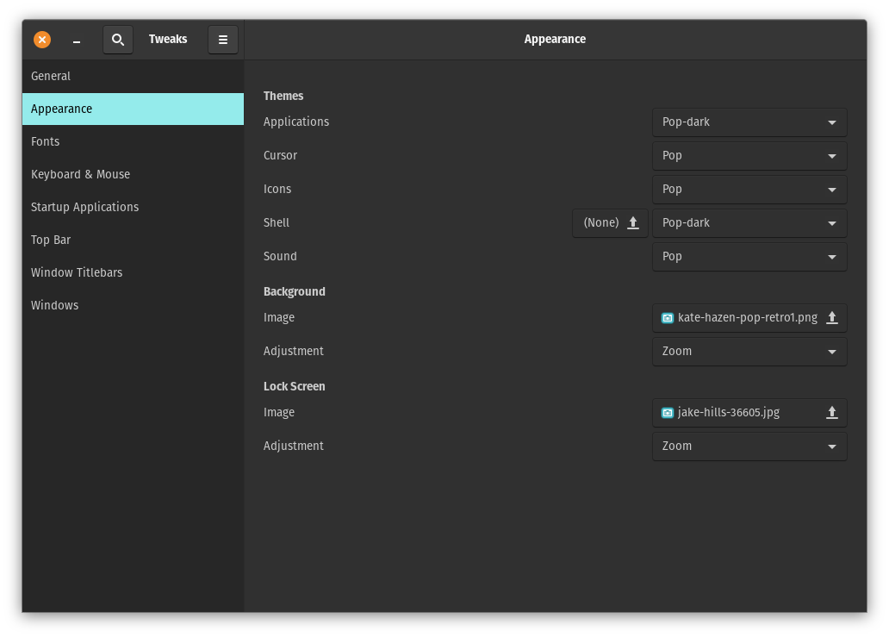
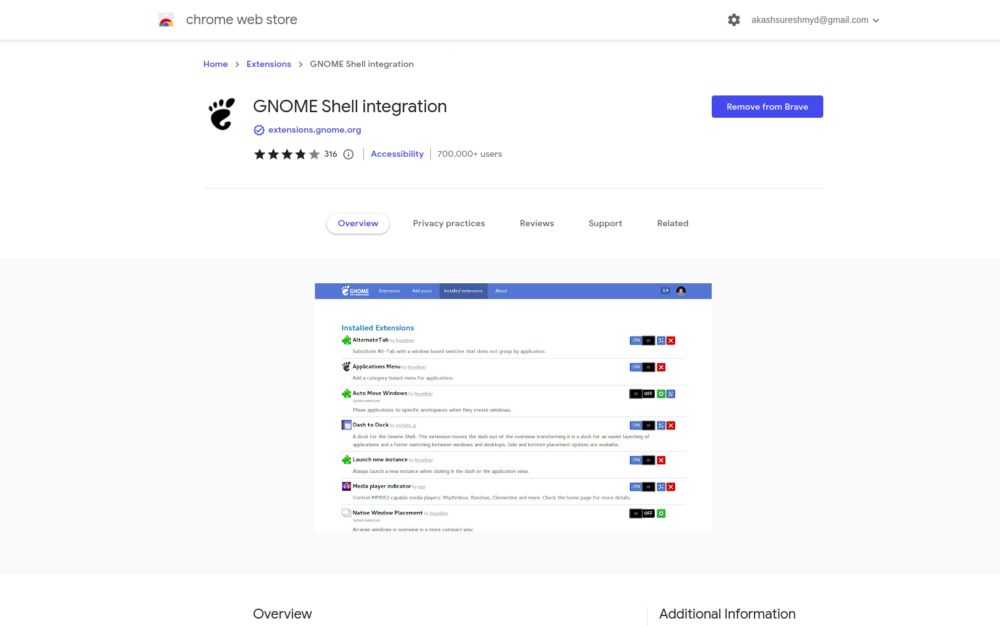
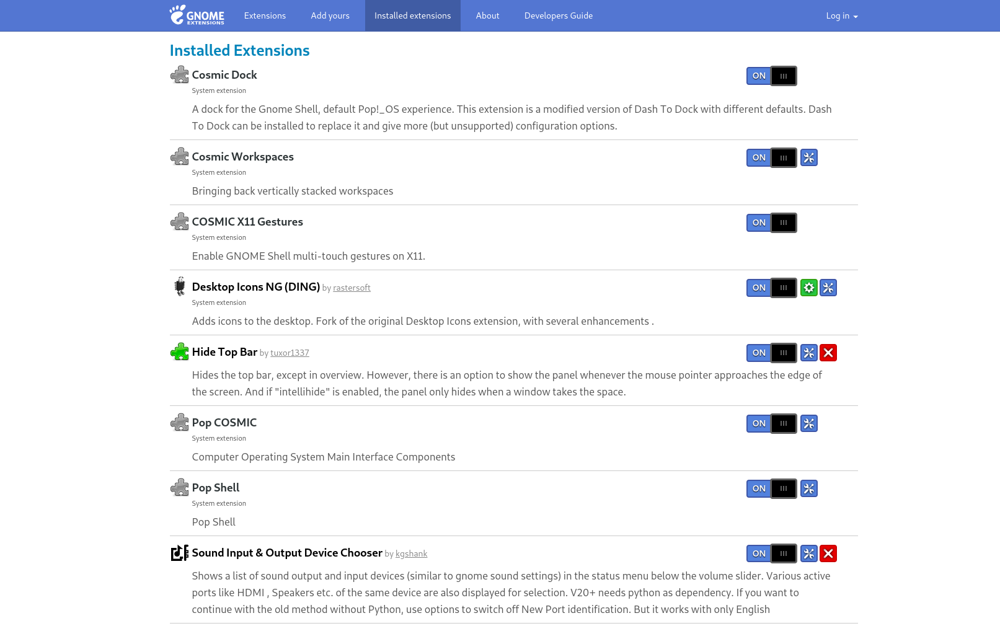
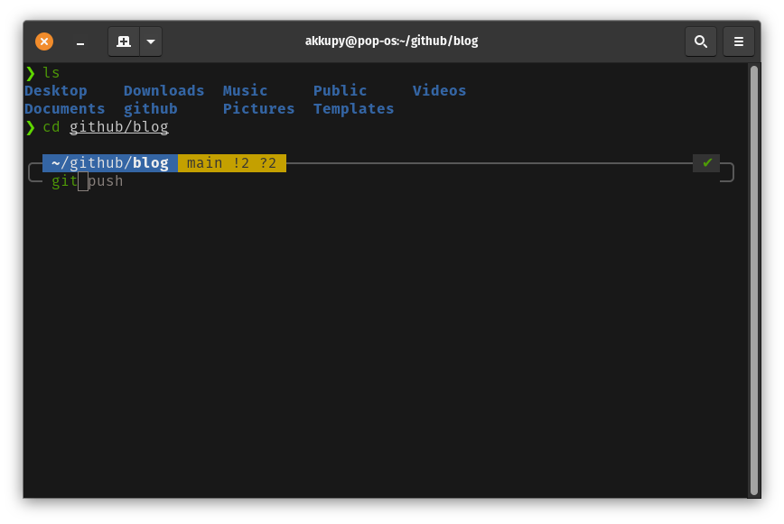

## Why i choose Pop!_os ?

Pop!_OS is a Linux distribution on top of Ubuntu. So, you get all the benefits of using Ubuntu and it`s well maintained.

No Snap garbage (.deb or flatpak only).

Built-in tileing window manager features.

Better implementation of Gnome 3.

Provides an AMD iso and a separate nVidia ISO with no video driver setup needed.

More hardware support, especially newer devices as System76 sells hardware with Pop installed.

Probably more.... so there is no reason to use Ubuntu over Pop!_OS

After i installed Pop!_OS I spend some time to customize it , so let me show you what I was able to do.


## Install Gnome Tweaks Tool

Gnome tweaks tool gives you additional configuration, and first of all, add minimize and maximize buttons.

```
sudo apt install gnome-tweak-tool
```

then open tweak tool and make the changes.



## Install GNOME Shell integration extension for google chrome or Mozilla fire fox



Now open it and install all the app you want.

This is my list of apps.



## Customize the Terminal



The default Terminal language is bash but i'll change it to zsh .

Bash and zsh are almost identical which is a relief. Navigation is the same between the two.

The commands you learned for bash will also work in zsh although they may function differently on output. 

Zsh seems to be much more customizable than bash. I’ll now run through a few features and how they differ in each.

Auto-completion Auto-correction Plug-in support.

### Setup

#### Install ZSH 

```
sudo apt install zsh
```

#### Set default shell to ZSH

After the installation is complete, it automatically selects ZSH as the default shell.

You can use the following command to check the current shel echo $SHELL .

In case if your default shell is not ZSH, then run the following command to make it default:

```
chsh -s $(which zsh)
```
Might need to logout or restart to take effect.(If that didn't work,install oh-my-zsh,which has a script that defaults zsh.)

#### Install and configure the oh-my-zsh

```
sudo apt install curl 

sh -c "$(curl -fsSL https://raw.githubusercontent.com/ohmyzsh/ohmyzsh/master/tools/install.sh)"
```

Oh-my-zsh is now installed on the system, and the Z shell has been configured for utilizing the oh-my-zsh framework with the default configuration.

##### Change default theme

The Oh-my-zsh framework provides many themes for your ZSH shell. 

You can go to the themes directory and see the list of available themes.

```
cd ~/.oh-my-zsh/themes/

ls -a

```

To change the default theme, we need to edit the .zshrc configuration file. Let's open it in the nano editor:

```
nano ~/.zshrc

```
Let's say we want to use the theme candy. Then change the ZSH_THEME with candy theme as below. 

```
ZSH_THEME="candy"

```

Save and exit. And reopen your terminal.

### My favorite ZSH theme is PowerLevel10k

Install Powerlevel10k using the following command.

```
git clone https://github.com/romkatv/powerlevel10k.git $ZSH_CUSTOM/themes/powerlevel10k

```

Then you need to enable it, change the value of ZSH_THEME to following in ~/.zshrc file :

```
ZSH_THEME="powerlevel10k/powerlevel10k"

```

Configure Powerlevel10k Theme or just restore the terminal.

```
p10k configure

```

### Plugins (Optional, Good to have!)

```
git clone https://github.com/zsh-users/zsh-syntax-highlighting ${ZSH_CUSTOM:-~/.oh-my-zsh/custom}/plugins/zsh-syntax-highlighting

git clone https://github.com/zsh-users/zsh-autosuggestions ${ZSH_CUSTOM:-~/.oh-my-zsh/custom}/plugins/zsh-autosuggestions

```

Activate the plugins In ~/.zshrc file replace the line starting with plugins=() to below line.

```
plugins=( git zsh-syntax-highlighting zsh-autosuggestions )

```
