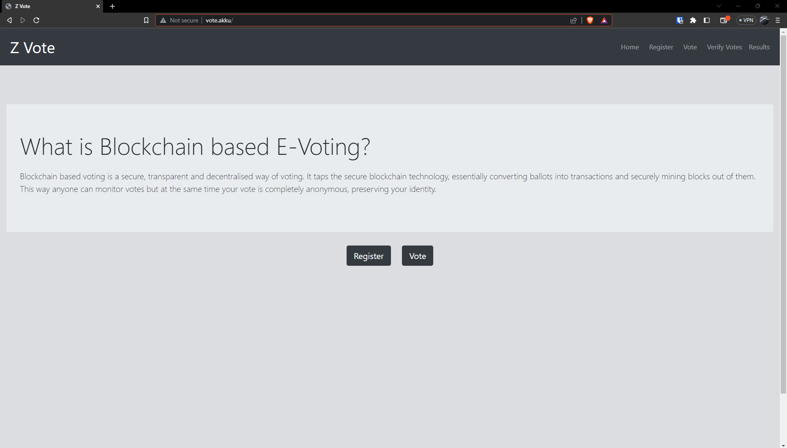
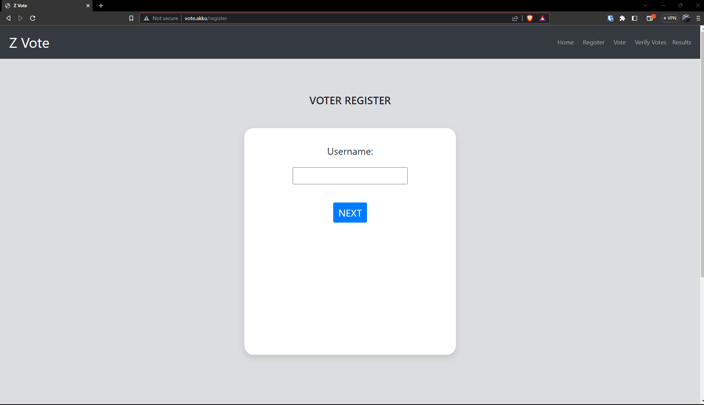
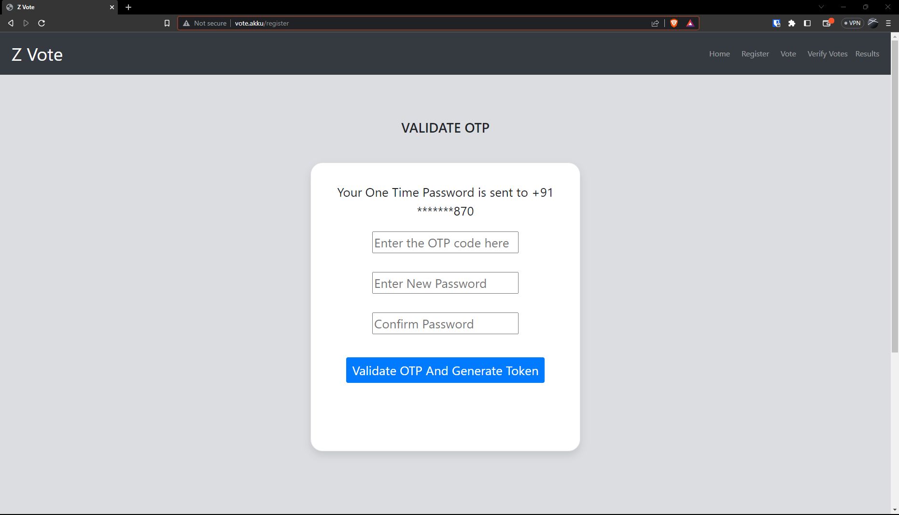
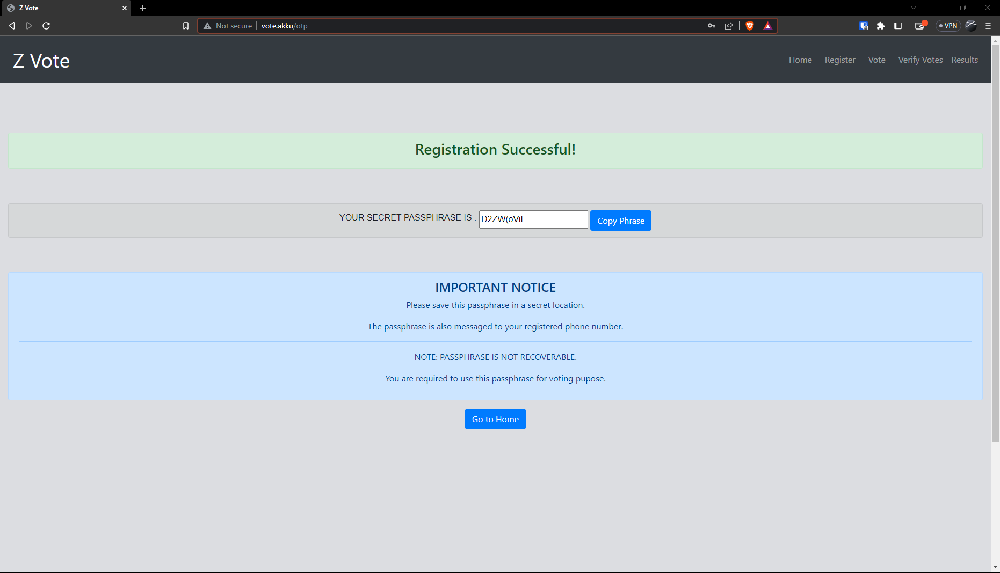
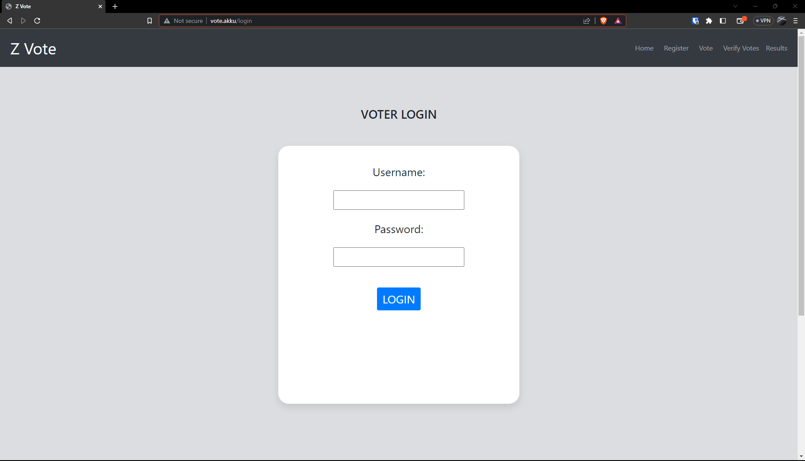
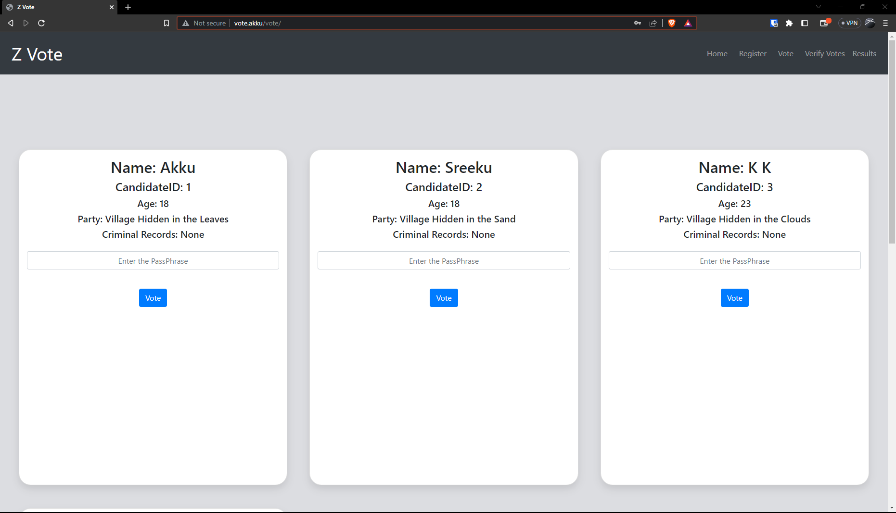
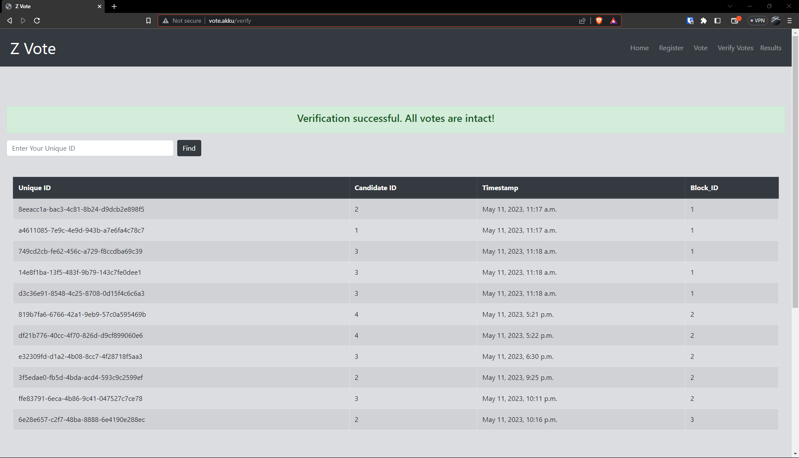
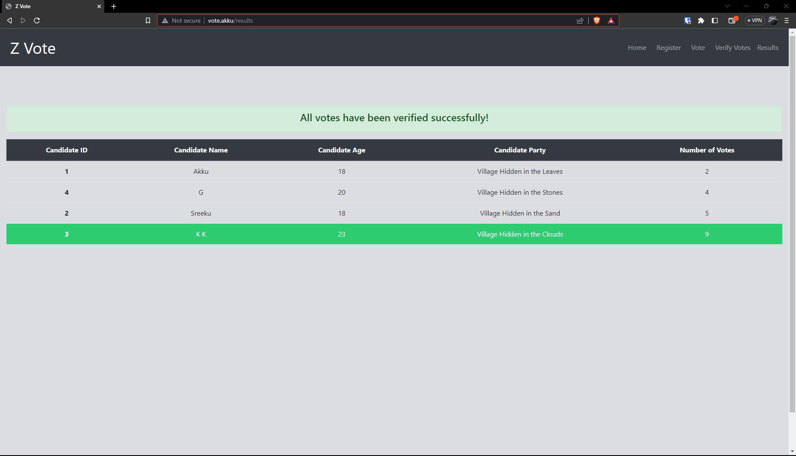

## BlockChain Based E-Voting System

* This project aims at implementing a voting system based on Blockchain technology. 
* It is a secure, transparent and decentralized way of voting.
* It converts ballots into transactions and securely mines blocks out of them.
* The advantage of a blockchain based voting system include the ability to vote from any place and prevent any tampering of votes.

## Report

[Download :fontawesome-solid-download:](../assets/content/zvote_report.pdf){ .md-button }

## Technology stack used:

1. Python 3.11.x
2. Django Web Framework 4.2.1
3. Bootstrap 4
4. DB SQLite 3
5. HTML5

## Self-hosting(Development Server)

### Simply clone the repository and run the server:
```sh
# Install Git First // (Else You Can Download And Upload to Your Local Server)
$ git clone https://github.com/akkupy/Z-Vote.git

# Open Git Cloned File
$ cd Z-Vote

# Config Virtual Env (Skip is already Done.)
$ virtualenv -p /usr/bin/python3 venv
$ . ./venv/bin/activate

# Install All Requirements.
$ pip(3) install -r requirements.txt

# Run makemigrations and migrate command.
$ python(3) manage.py makemigrations poll
$ python(3) manage.py migrate

# Create a Superuser.
$ python(3) manage.py createsuperuser

# Create a .env file(See Below for more details.)

# Start Server
$ python(3) manage.py runserver 0.0.0.0:80
# Head over to http://127.0.0.1/ to see the website.

# Head over to http://127.0.0.1/admin to add the voterlists in 'Voter lists' table and the candidates in the 'Candidates' table.

# Set the Voting Time in 'Vote auths' table(Create only one object and add the start and end time of voting).

# Now the project is ready for Voting!
```

## Environment Variables

1. Go to [API NINJA](https://api-ninjas.com/) and signup to obtain the api key for passphrase generation.
2. Create an Account on [TWILIO](https://www.twilio.com/try-twilio) and Buy a Phone Number to use the OTP Service.

Fill the .env file with the obtained values.

```
[+] Create a .env file in the root directory for the api tokens
    [-] API_NINJA_API = ''
    [-] TWILIO_ACCOUNT_SID = ''
    [-] TWILIO_AUTH_TOKEN = ''
    [-] TWILIO_PHONE_NUMBER = ''
```


### An Example Of ".env" File
```
API_NINJA_API = '/ghjf53spoG657vghjygdr0qw==uRVWERV'
TWILIO_ACCOUNT_SID = 'AA3w5fgdrfawd3459faedw4349a3b'
TWILIO_AUTH_TOKEN = 'awd18f3ccac7329thfsf43fd4drgx1'
TWILIO_PHONE_NUMBER = '+134656544'
```

## Screenshots:

















## Contact Me
 [](https://t.me/akkupy)


## License
[](http://www.gnu.org/licenses/gpl-3.0.en.html)  

This is a Free Software: You can use, study share and improve it at your
will. Specifically you can redistribute and/or modify it under the terms of the
[GNU General Public License](https://www.gnu.org/licenses/gpl.html) as
published by the Free Software Foundation, either version 3 of the License, or
(at your option) any later version. 


 --This is only a demonstration of the blockchain based voting system and it is entirely a prototype of the technology--


